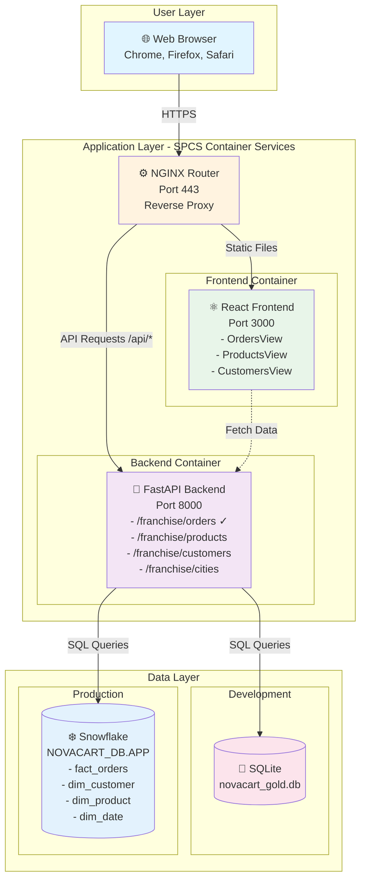
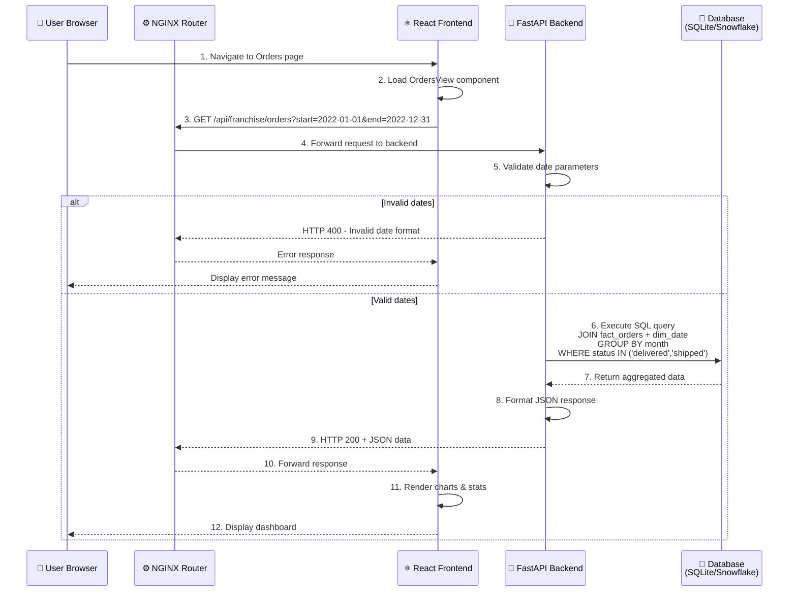
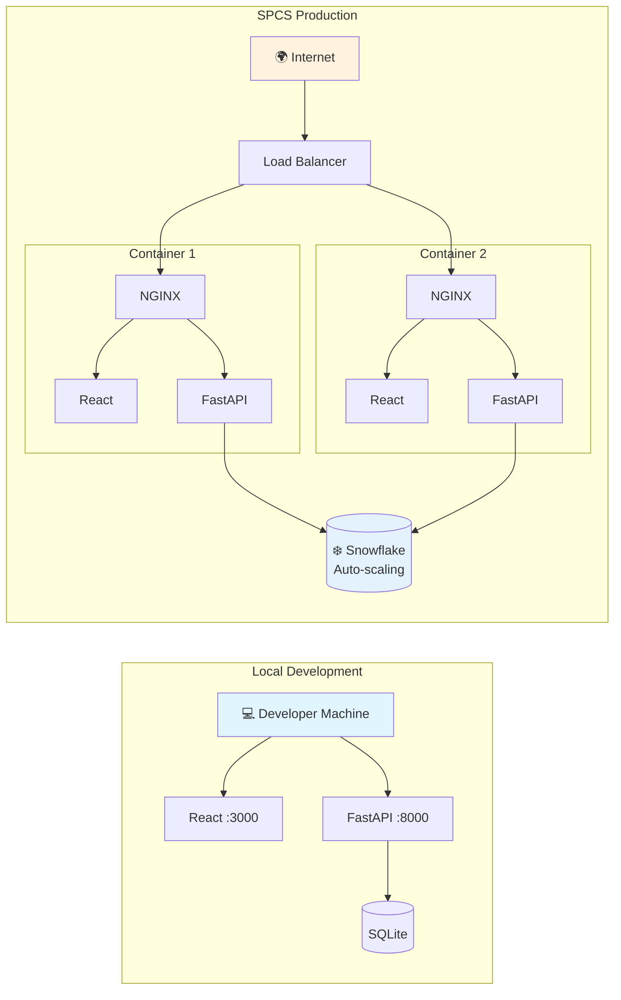
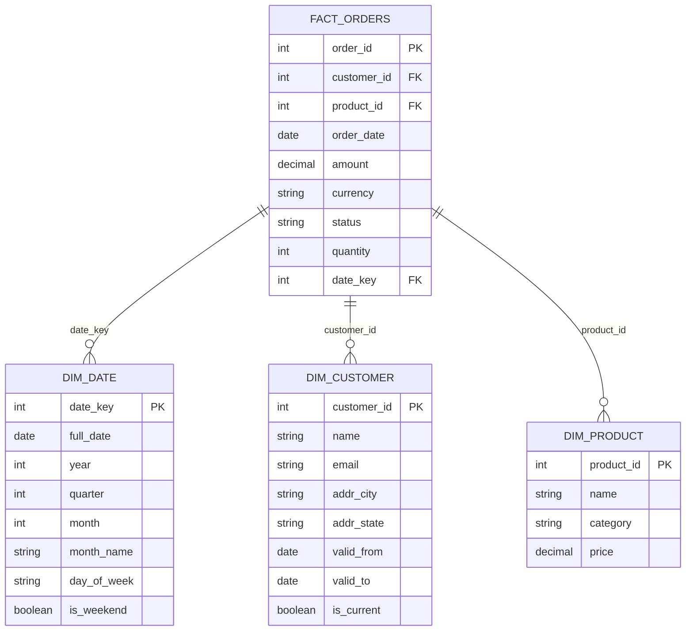
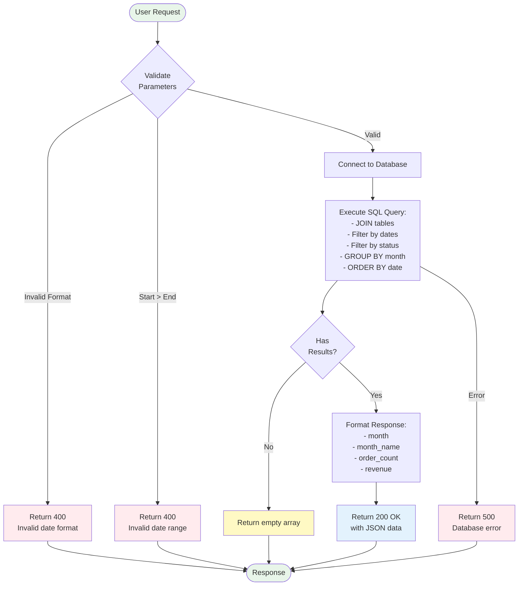
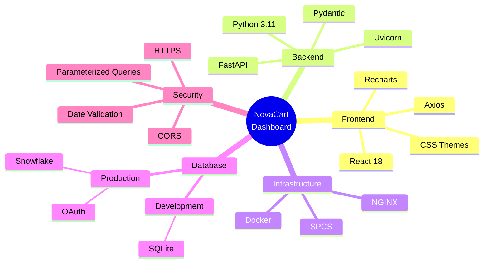
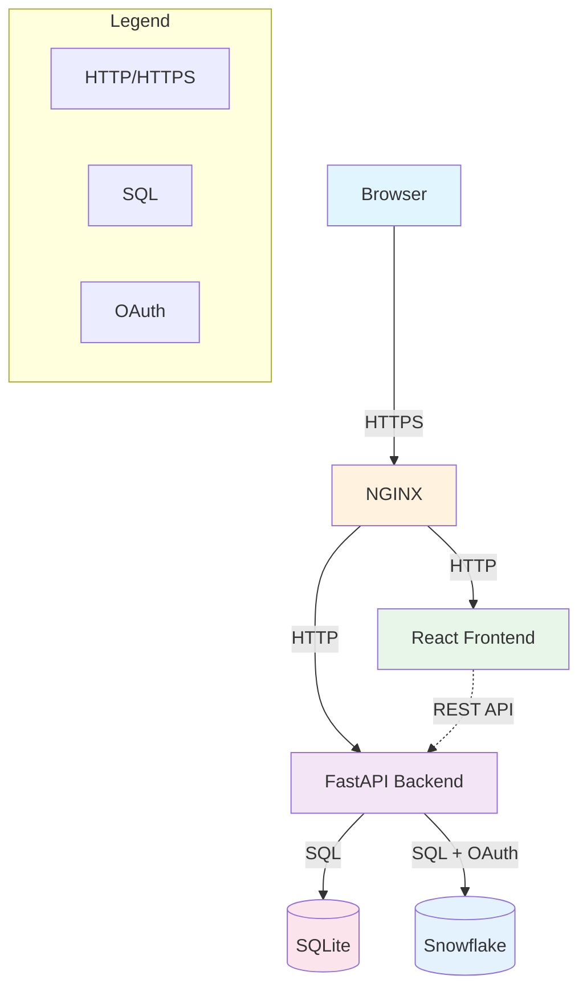

# NovaCart Architecture - Mermaid Diagrams

## System Architecture (Mermaid Format)

### High-Level Component Diagram

### Data Flow - Orders Endpoint

### Deployment Architecture

### Database Schema Relationships

### API Request Flow

### Technology Stack

### Component Communication Matrix

## How to Use These Diagrams

### In Markdown Viewers
Most modern markdown viewers (GitHub, GitLab, VS Code, etc.) support Mermaid diagrams natively. Simply paste the code blocks above.

### In Documentation Tools
- **Confluence**: Use the Mermaid plugin
- **Notion**: Use the Mermaid block
- **GitBook**: Native Mermaid support
- **MkDocs**: Use the mermaid2 plugin

### Export as Images
Use online tools like:
- https://mermaid.live/
- https://mermaid.ink/

### In Presentations
1. Render diagrams using mermaid.live
2. Export as PNG/SVG
3. Import into PowerPoint/Google Slides

---

**Note**: These diagrams complement the detailed ASCII diagrams in `ARCHITECTURE_DIAGRAM.md`